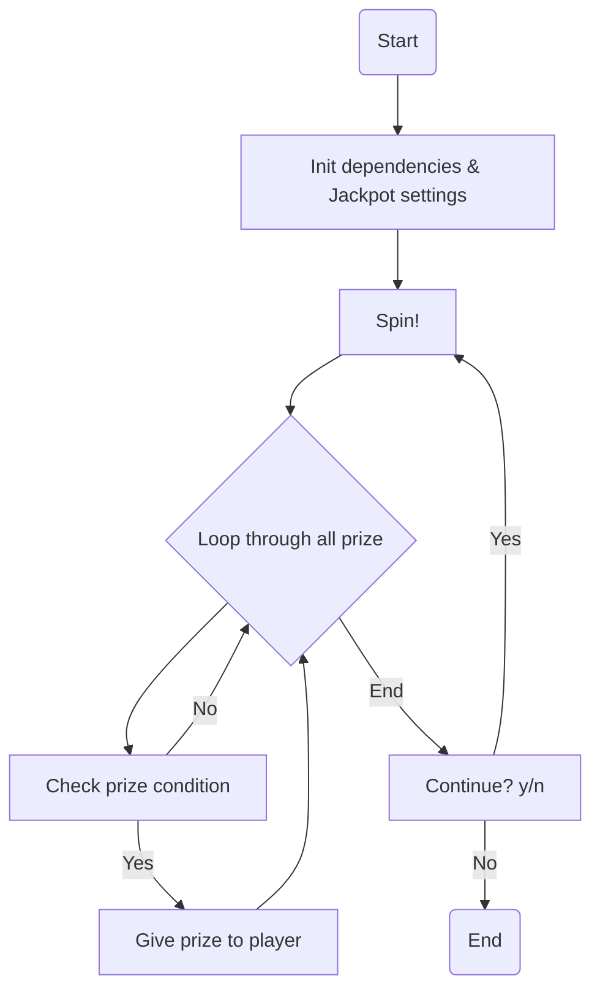
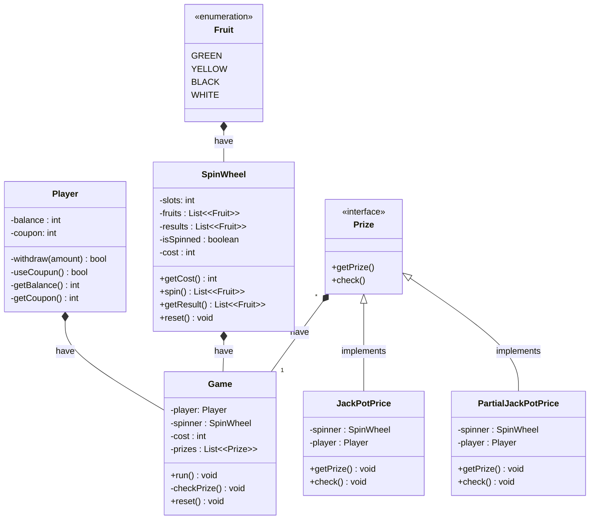

# FruitJackpot
A simple CLI Program to play jackpot similar to in casino, but instead of 777, now using fruits as the symbol. Created to remind myself how to use Java again. Utilizing OOP and design pattern as best as I could. 

Will be continued as a 1-2 hour series small programs

## Application Flow

## Class Diagram (not updated)
